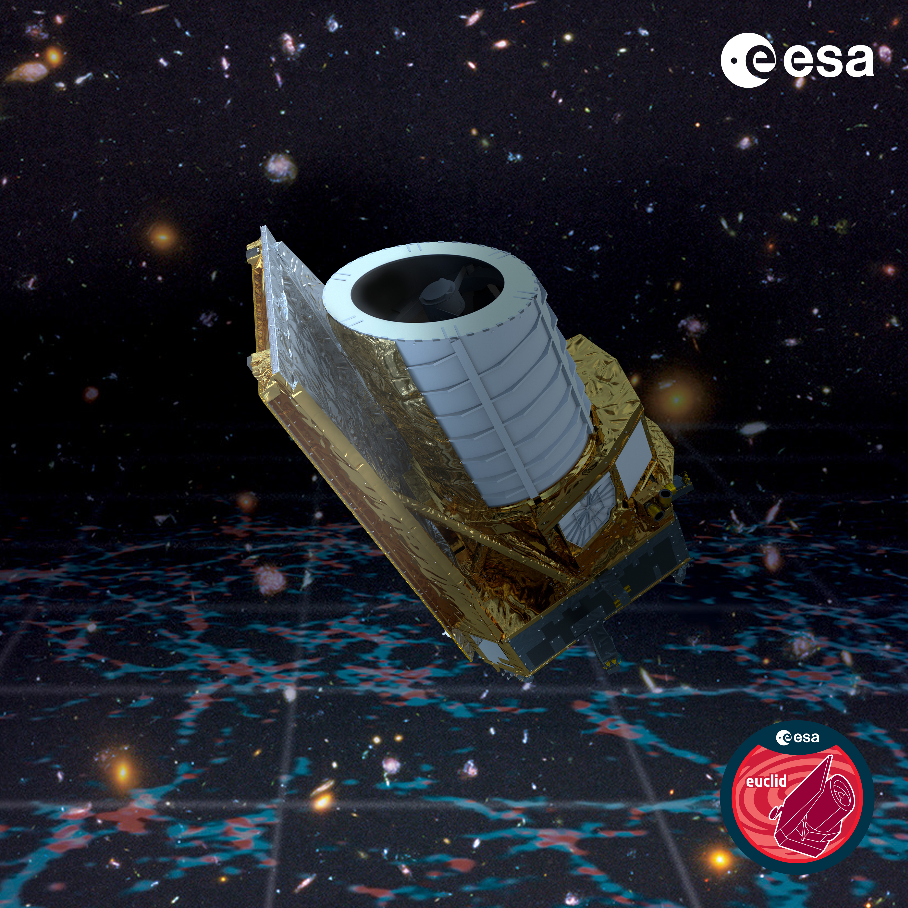

# Blog

Hier sind meine Blogeinträge.

## [Digital Detox](Blog/Digital_Detox.md)
Vom 14.08.2023

[Das Internet scheint grenzenlos zu sein. Jeden Tag wird eine unvorstellbare Größe an neuem Inhalt erzeugt und nur zu bestimmten teilen auch konsumiert bzw verarbeitet. In früheren Zeit waren es mehr die Links, die uns zu](Blog/Digital_Detox.md)

## [Alte Blogeinträge auf Wordpress](https://novalisgedanken.wordpress.com/)
[ 
   
](https://novalisgedanken.wordpress.com/)

[Auf meinem alten Blog auf Wordpress sind noch meine alten Blogeinträge zu finden.](https://novalisgedanken.wordpress.com/)

https://novalisgedanken.wordpress.com/

## [Euclid Teleskop](Blog/Euclid_Teleskop.md)
Vom 03.07.2023
[
  
](Blog/Euclid_Teleskop.md)
Foto von [ESA](https://www.esa.int/Science_Exploration/Space_Science/Euclid/Euclid_wallpapers)

[Vor einigen Tagen am 1.7.2023 wurde ein weiteres Weltraumteleskop gestartet, das Euclid Teleskop. Es ist eines von vielen die derzeit im Weltraum den Weltraum beobachten wie das Webb Teleskop...](Blog/Euclid_Teleskop.md)

## [Neuer Alter Blog](Blog/Neuer_alter_Blog.md)
Vom 30.06.2023
[
  
](Blog/Neuer_alter_Blog.md)
"Foto von <a href="https://unsplash.com/fr/@marekpiwnicki?utm_source=unsplash&utm_medium=referral&utm_content=creditCopyText">Marek Piwnicki</a> auf <a href="https://unsplash.com/de/fotos/der-nachthimmel-mit-sternen-uber-einer-bergkette-epdbc0xRjiI?utm_source=unsplash&utm_medium=referral&utm_content=creditCopyText">Unsplash</a>"

[Aus den langen Winterschlaf endlich erwacht, erscheint nun mein neuer Blog auf Github. Man fragt sich bestimmt, warum? Der Grund lässt sich ganz einfach erklären...](Blog/Neuer_alter_Blog.md)

 Dieses Werk ist lizenziert unter einer <a rel="license" href="http://creativecommons.org/licenses/by-sa/4.0/">Creative Commons Namensnennung - Weitergabe unter gleichen Bedingungen 4.0 International Lizenz</a>.