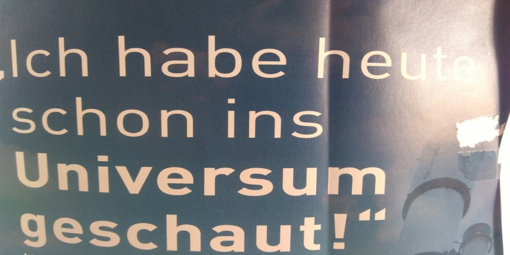
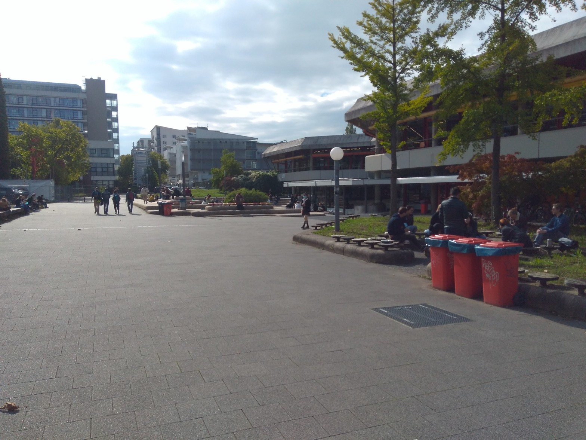
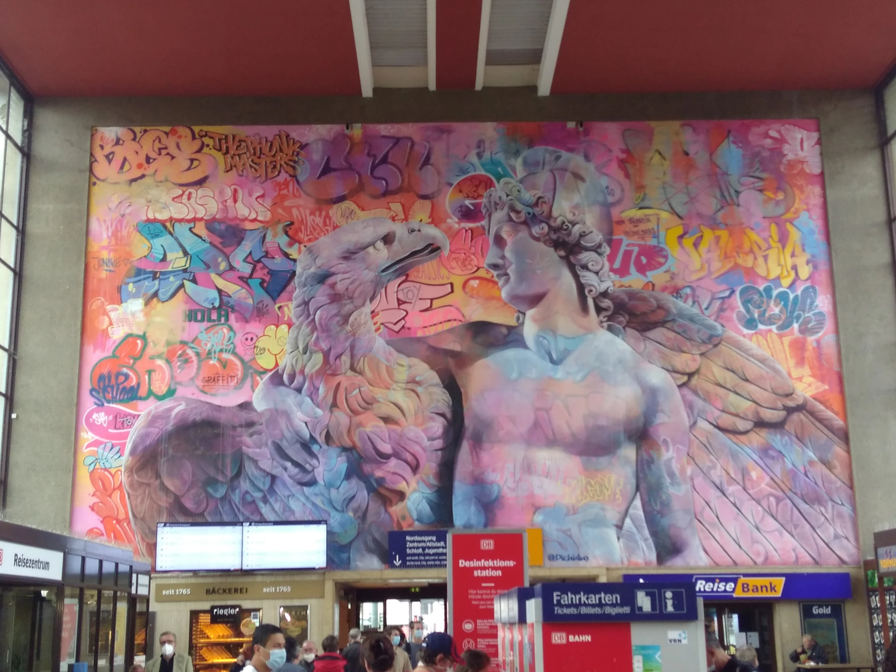
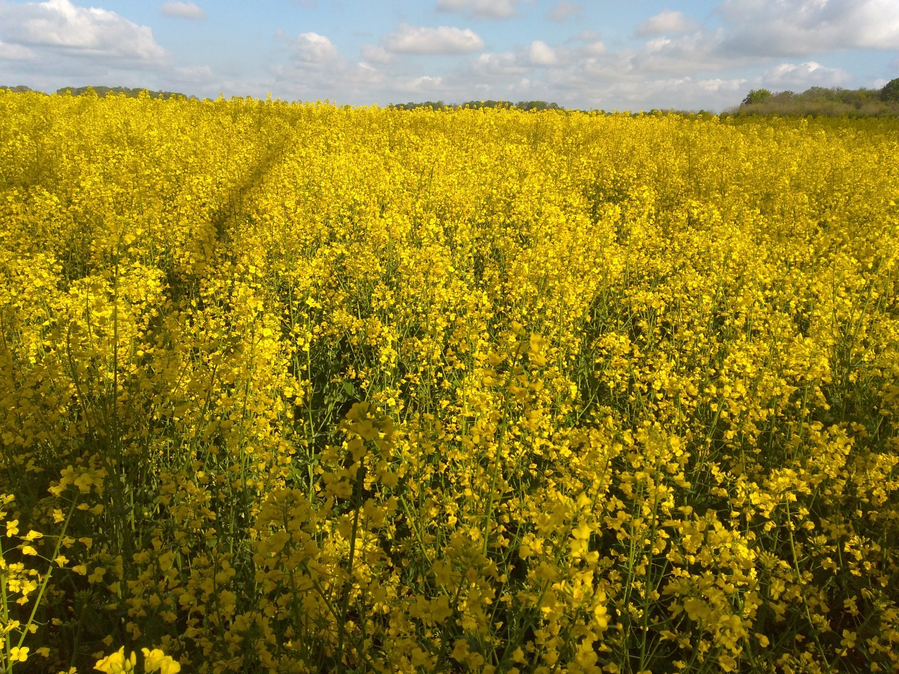

# Blog

Hier sind alle Einträge.

## [Maschinelles Lernen I Unikurs](Blog/Maschinelles_Lernen_I.md)

Meine Zusammenstellung von Notizen vom Kurs Maschinelles Lernen I an der Universität Potsdam im Sommersemester 24.

[Hier gehts zur Seite](https://christiang7.github.io/Maschinelles-Lernen-I/) vom 17.4.2024

## [Spring School 2024 AEI](Blog/Spring-school-2024.md)

Meine Zusammenstellung von Notizen von der Spring School 2024 am Albert Einstein Institut.

[Hier gehts zur Seite](https://christiang7.github.io/Spring-School-2024/#/) vom 4.4.2024

## [Kontinuirliche Gruppen und Symmetrien](Blog/Gruppen-Symmetrie.md)

Meine Zusammenstellung von Notizen vom Kurs Kontinuirliche Gruppen und Symmetrien an der Universität Potsdam im Wintersemester 23/24.

[Hier geht es zur Seite](https://christiang7.github.io/Kontinuierliche_Gruppen_und_ihre_Anwendungen_in_der_Quantenphysik_Unikurs/#/) vom 4.4.2024

## [Numerical relativity hydrodynamics Unikurs](Blog/Numerical-relativity.md)

Meine Zusammenstellung von Notizen vom Numerical relativity hydrodynamics Kurs an der Universität Potsdam im Wintersemester 23/24.

[Hier geht es zur Seite](https://github.com/christiang7/Numerical_relativity_hydrodynamics_Unikurs) vom 4.4.2024

## [Spiele auf Linux](Blog/Spiele_auf_Linux.md)

Alle die Linux nutzen kennen den Umstand, wenn man mal ein Spiel spielen möchte, ist das nicht so einfach möglich. Man konnte oft nur den Weg gehen beide Systeme auf dem Rechner zu installieren und dann dorthin zu wechseln, [was ...](Blog/Spiele_auf_Linux.md) vom 15.8.2023

## [Offene Lizenzen für alles](Blog/Offene_Lizenzen_für_alles.md)

Heute hatte ich mich mit der Lizenzierung von Ideen und Werken beschäftigt. Dabei stieß ich schnell bei meiner Suche auf die Creative Commons. Ich dachte, dass diese nur für Kunst und auch Quell Code genutzt werden kann, [aber ...](Blog/Offene_Lizenzen_für_alles.md) vom 14.08.2023

## [Digital Detox](Blog/Digital_Detox.md)

Das Internet scheint grenzenlos zu sein. Jeden Tag wird eine unvorstellbare Größe an neuem Inhalt erzeugt und nur zu bestimmten teilen auch konsumiert bzw. verarbeitet. In früheren Zeiten waren es mehr die Links, [die uns zu ...](Blog/Digital_Detox.md) vom 14.08.2023

## [Alte Blogeinträge auf Wordpress](https://novalisgedanken.wordpress.com/)
[ 
   
](https://novalisgedanken.wordpress.com/)

Auf meinem alten Blog auf Wordpress sind noch meine alten Blogeinträge zu finden.

https://novalisgedanken.wordpress.com/

## [Euclid Teleskop](Blog/Euclid_Teleskop.md)
[
  
](Blog/Euclid_Teleskop.md)
Foto von [ESA](https://www.esa.int/Science_Exploration/Space_Science/Euclid/Euclid_wallpapers)

Vor einigen Tagen am 1.7.2023 wurde ein weiteres Weltraumteleskop gestartet, das Euclid Teleskop. Es ist eines von vielen die derzeit im Weltraum den Weltraum beobachten wie [das Webb Teleskop ...](Blog/Euclid_Teleskop.md) vom 03.07.2023

## [Neuer Alter Blog](Blog/Neuer_alter_Blog.md)
[
  
](Blog/Neuer_alter_Blog.md)
"Foto von <a href="https://unsplash.com/fr/@marekpiwnicki?utm_source=unsplash&utm_medium=referral&utm_content=creditCopyText">Marek Piwnicki</a> auf <a href="https://unsplash.com/de/fotos/der-nachthimmel-mit-sternen-uber-einer-bergkette-epdbc0xRjiI?utm_source=unsplash&utm_medium=referral&utm_content=creditCopyText">Unsplash</a>"

Aus den langen Winterschlaf endlich erwacht, erscheint nun mein neuer Blog auf Github. Man fragt sich bestimmt, warum? Der Grund lässt sich ganz einfach [erklären ...](Blog/Neuer_alter_Blog.md) vom 30.06.2023

## [Wochenfragmente 22.14](Blog/Wochenfragmente_22.14.md)
[
  
](Blog/Wochenfragmente_22.14.md)

In dieser Wochenfragmentausgabe gibt es wieder einen fragmentarischen Gedankengang über Physik und Wissen und ein Video über die Schönheit der Natur und wie sie Ausdruck in der Kunst findet. Überall ist die Welt vorhanden Ich habe mir überlegt, dass die Welt, damit sie funktioniert und überall konsistent ist, muss sich in jedem Raumabschnitt die [gleiche ...](Blog/Wochenfragmente_22.14.md) vom 10\. April 2022

## [Wochenfragmente 22.13](Blog/Wochenfragmente_22.13.md)
[
  
](Blog/Wochenfragmente_22.13.md)

Heute gibt es eine Gedankengang von mir und ein Video über die gesellschaftliche Übersensibilisierung in politischen Themen, wobei auch immer der Klimawandel leider vergessen wird in dieser Debatte. Gedanken über Trägheit und Erhaltung Die Trägheit sorgt dafür, dass Dinge erhalten bleiben wie bei der Bewegung. Ein Erhaltungsprozess in der Physik ausgedrückt durch die Erhaltungssätze [wie ...](Blog/Wochenfragmente_22.13.md) vom 30\. März 2022

## [Wochenfragmente 22.12](Blog/Wochenfragmente_22.12.md)
[
  
](Blog/Wochenfragmente_22.12.md)

Heute gibt es wieder nur zwei Videos, die ich schon länger in meinem Zettelkasten verstaut habe und nun euch gerne präsentiere im Sinne des Lebens und der Schönheit der Natur, in der Tradition der Romantik. Ein sehr schönes Video über eine Frau, die ein Leben auf Island führt und dort Gerberin ist. Ihre inspirierende [Haltung ...](Blog/Wochenfragmente_22.12.md) vom 21\. March 2022

## [Wochenfragmente 22.11](Blog/Wochenfragmente_22.11.md)
[
  
](Blog/Wochenfragmente_22.11.md)

Nach einer langen Pause meldet sich der Blog wieder zurück aus dem Winterschlaf. Wie der kleine Samen im Bild aus der Erde hervor kommt, so geschieht es auch mit diesem Blog. Für heute gibt es wieder neue Wochenfragmente (siehe die letzten Wochenfragmente 43) und noch eine kleine Erklärung zur Nummerierung der Wochenfragmente. Die erste [Zahl ...](Blog/Wochenfragmente_22.11.md) vom 13\. March 2022

## [Wochenfragmente 21.43](Blog/Wochenfragmente_21.43.md)
[
  
](Blog/Wochenfragmente_21.43.md)

Wer das erste Wochenfragment verpasst hat hier nochmal der Link Wochenfragmente 42 Video über Kampfkunst Am Anfang des Videos wird über die Kampfkunst in dem Film Matrix gesprochen. Sie besitzt dort die Aufgabe sich gegen eine Unterdrückung zu wehren durch die Maschine und der Moderne. Das ist sehr inspirierend. Aber es deckt sich mit [meinen ...](Blog/Wochenfragmente_21.43.md) vom 29\. October 2021

## [Heidelbergreise - Tag 7 und Abreise](Blog/Heidelbergreise_Tag_7_und_Abreise.md)
[
  
](Blog/Heidelbergreise_Tag_7_und_Abreise.md)

Nach dem Tag in der Altstadt mit vollem Sightseeing, geht es heute ab in die Natur von Heidelberg. Am Morgen nur noch schnell im Hotel auschecken und dann gibt es noch eine kleine Reise hin zum Philosophenweg. Der Weg ging am Fuße des Heiligenbergs los. Der Berg ist ungefähr 430 m hoch und ich nahm [mir ...](Blog/Heidelbergreise_Tag_7_und_Abreise.md) vom 28\. October 2021

## [Wochenfragmente 21.42](Blog/Wochenfragmente_21.42.md)
[
  
](Blog/Wochenfragmente_21.42.md)

Hier meine neue Artikelserie, die Wochenfragmente. Ich werde versuchen wochenweise Fragmente aus meinem Gedankenspeicher(Zettelkasten) in einer Übersicht veröffentlichen, wie in der Tradition von Novalis, wo die meisten seiner Schriften fragmentarisch überliefert worden sind. Fragmente Etwas ist aus einem großen Ganzen gebrochen oder erhalten. Es ist nicht abgeschlossen. Es kann weitergeführt werden oder bildet schon [den ...](Blog/Wochenfragmente_21.42.md) vom 23\. October 2021

## [Heidelbergreise - Tag 6 und Stadterkundung](Blog/Heidelbergreise_Tag_6_und_Stadterkundung.md)
[
  
](Blog/Heidelbergreise_Tag_6_und_Stadterkundung.md)

Nach den Graduate Days ging es nun an die Stadterkundung und der näheren Umgebung. Am Morgen machte ich mir erst einmal Gedanken, was ich genau heute so alles sehen und erkunden wollen würde. Ich schnappte mir die ganzen Flyer vom Anreisetag und blätterte mal so durch. Aber zuerst kam mir noch in den Sinn [meine ...](Blog/Heidelbergreise_Tag_6_und_Stadterkundung.md) vom 23\. October 2021

## [Heidelbergreise - Tag 2-5 Graduate Days](Blog/Heidelbergreise_Graduate_Days_Tag_2-5.md)
[
  
](Blog/Heidelbergreise_Graduate_Days_Tag_2-5.md)

Die weiteren Tage mit den Graduate Days verliefen wie der Tag 1 ab und es gab einige Highlights, die ich hier näher beleuchten möchte. Dienstag Am Dienstag hatte ich mir noch kurz das Institut für theoretische Physik angeschaut, es liegt direkt am Philosophenweg. Die haben es dort sehr schön, alles wie in einem Garten [angelegt ...](Blog/Heidelbergreise_Graduate_Days_Tag_2-5.md) vom 14\. October 2021

## [Heidelbergreise - Tag 1 und der Anfang der Graduate Days](Blog/Heidelbergreise_Tag_1_und_der_Anfang_der_Graduate_Days.md)
[
  
](Blog/Heidelbergreise_Tag_1_und_der_Anfang_der_Graduate_Days.md)

Am Montag fingen die Graduate Days an der Heidelberger Universität an. Ich war am Sonntag schon da und wusste deshalb schnell, wohin ich zu gehen habe. Es regnete sehr stark am Morgen und ich fuhr das einzige Mal mit der Straßenbahn, ansonsten lief ich immer zur Uni. An der Uni einigermaßen trocken angekommen, wurde [Ich ...](Blog/Heidelbergreise_Tag_1_und_der_Anfang_der_Graduate_Days.md) vom 11\. October 2021

## [Heidelbergreise - Tag 0,5 und Anfahrt](Blog/Heidelbergreise_0,5_Tag_und_Anfahrt.md)
[
  
](Blog/Heidelbergreise_0,5_Tag_und_Anfahrt.md)

Großes Bild am Heidelberger Bahnhof Endlich ist es so weit, Heidelberg ich komme. Ich erfülle mir einen langersehnten Traum, einmal nach Heidelberg zu fahren und am 3.10. fuhr ich hin. Dafür musste ich sehr früh aufstehen, so um 5 Uhr, um nochmal alle Sachen zu checken und billig Zug zu fahren. Ich hatte zwar [kaum ...](Blog/Heidelbergreise_0,5_Tag_und_Anfahrt.md) vom 4\. October 2021

## [Sinn und absurde Philosophie](Blog/Sinn_und_absurde_Philosophie.md)
[
  
](Blog/Sinn_und_absurde_Philosophie.md)

Jeder Mensch ist auf der Suche nach dem Sinn in seinem Leben. Die Philosophie kann ein Wegweiser sein, aber auch uns jeglichen Sinn im Leben nehmen, wie es der Philosoph Albert Camus in seinen Werken getan hat. Im Video wird deutlich warum und wie es philosophisch zu deuten ist. Er versuchte sogar einen Ausweg [zu ...](Blog/Sinn_und_absurde_Philosophie.md) vom 26\. July 2021

## [Mathematisches Pläuschchen – Farbige Formeln](Blog/Mathematisches_Pläuschchen_-_Farbige_Formeln.md)

Die Einstein Gleichung aus der Relativitätstheorie. Schon seit meiner Schulzeit begleiten mich farbige Buchstaben und Zahlen. Jede Zahl hat für mich eine konkrete Farbe, was als Synästhesie bezeichnet wird, bestimmte Sinneseindrücke werden miteinander kombiniert wahrgenommen. Daher glaube ich kommt mein Hang meine Notizen mit allerlei Farben und Formen zu bestücken, dass sie mehr Reize [enthalten ...](Blog/Mathematisches_Pläuschchen_-_Farbige_Formeln.md) vom 22\. July 2021

## [Kyudotagebuch – Kari die Wildgans](Blog/Kyudotagebuch_-_Kari_die_Wildgans.md)
[
  
](Blog/Kyudotagebuch_-_Kari_die_Wildgans.md)

Foto von Clare Smallwood auf Unsplash In der letzten Woche fuhr ich wie gewohnt zum Berliner Kyudotraining und lass auf dem Weg dorthin die Kyudozeitschrift Zanshin. In einem Artikel von dem Großmeister Awa Kenzo, der sehr umstritten war in seinen Ansichten über Kyudo, aber einer der besten Schützen, der je gelebt hat. Man sagt [er ...](Blog/Kyudotagebuch_-_Kari_die_Wildgans.md) vom 22\. July 2021

## [Kyudotagebuch – Im Flow sein](Blog/Kyudotagebuch_-_Im_Flow_sein.md)
[
  
](Blog/Kyudotagebuch_-_Im_Flow_sein.md)

In der vorletzten Woche ging es wieder weiter mit dem guten Kyudotraining. Als ich wie immer mit dem Zug zum Kyudo fuhr, hatte ich diesmal keine wirkliche Idee, worauf ich mich heute verstärkt konzentrieren sollte, also ein konkretes Ziel. Klar war für mich, an den Punkten zu arbeiten, die mir Thomas das letzte Mal [unterrichtet ...](Blog/Kyudotagebuch_-_Im_Flow_sein.md) vom 12\. July 2021

## [Mathematisches Pläuschchen – Wie kommt man von der Hälfte zum Drittel?](Blog/Mathematisches_Pläuschchen_-_Wie_kommt_man_von_der_Hälfte_zum_Drittel.md)
[
  
](Blog/Mathematisches_Pläuschchen_-_Wie_kommt_man_von_der_Hälfte_zum_Drittel.md)

Eine Idee die mir schon seit Anfang meines Physikstudiums im Kopfe herumkreist. Ich hatte einen Dozenten, der verzweifelt versuchte in seiner Vorlesung die Tafel in drei gleich große Stücke aufzuteilen. Wer es schon einmal selbst probiert hat, ohne ein Lineal zu benutzen, stellt schnell fest, dass das überhaupt nicht einfach ist. Was man mit [dem ...](Blog/Mathematisches_Pläuschchen_-_Wie_kommt_man_von_der_Hälfte_zum_Drittel.md) vom 4\. July 2021

## [Kyudotagebuch – Endlich aufs Mato schießen](Blog/Kyudotagebuch_-_Endlich_aufs_Mato_schießen.md)
[
  
](Blog/Kyudotagebuch_-_Endlich_aufs_Mato_schießen.md)

Von letzter Woche noch etwas voll mit neuen Eindrücken und gespannt wie es weiter geht, ging es wieder weiter mit dem Kyudotraining auf dem Platz. An diesem Montag war es sehr heiß, zum Glück war der Zug nicht voll und die Klimaanlagen taten ihr Bestes. Auf den wunderschönen Platz ankommend ging mit noch vom [letzten ...](Blog/Kyudotagebuch_-_Endlich_aufs_Mato_schießen.md) vom 25\. June 2021

## [Kyudotagebuch – Ein Neubeginn](Blog/Kyudotagebuch_-_Ein_Neubeginn.md)
[
  
](Blog/Kyudotagebuch_-_Ein_Neubeginn.md)

Endlich, nach langer Abstinenz vom Kyudotraining durch die gute Corona geht es wieder los meine Freunde. Letzte Woche ging es wieder auf den Platz zum Kyudotraining. Die Bögen wurden aus ihrem Winterschlaf geweckt und fleißig gespannt, dazu wurden die Pfeile und die gesamte Ausrüstung einer gründlichen Überprüfung unterzogen, damit wir wieder befreit japanisches Bogenschießen [ausüben ...](Blog/Kyudotagebuch_-_Ein_Neubeginn.md) vom 22\. June 2021

## [Watt is’n datt hier?](Blog/Watt_is’n_datt_hier.md)
[
  
](Blog/Watt_is’n_datt_hier.md)

Raps! aber darum soll es hier nicht gehen. Es ist der erste Blogeintrag mit einer kleinen Vorstellung meinerseits und über die Absicht des Blogs: Ich bin Christian Gößl und komme aus der Gegend Berlin-Brandenburg (watt den schönen Artikeltitel erklärt 😉). Ich bin so ziemlich interessiert auf die Welt und auf ihre Erscheinungen. Mein [Weg ...](Blog/Watt_is’n_datt_hier.md) vom 17\. June 2021

