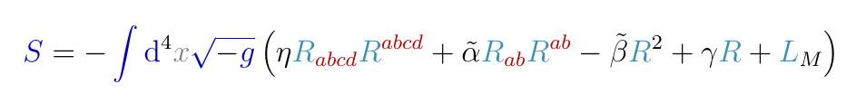
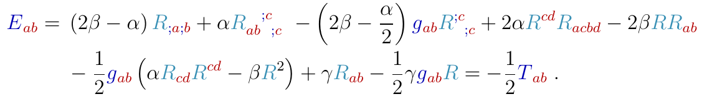

# Forschung - Research

Eine Übersicht über meine Forschungsarbeit.

[Masterthesis](https://github.com/christiang7/Master_thesis_aspects_of_field_theories_in_higher_derivative_terms)(finished): Aspects of field theories in higher derivative terms. How can we deal with higher derivative terms in the action integral and in the following equations of motion? 

     

     

A mathematical solution was found, but no physical explanation for that.

Tags: General relativity, High energy physics, Ostrogradski instabilities, Field theory

**Research structure in physics(idea)** - I try to analyze the structure of researching in physics and build an overview of the methods and structure. 

**GitHub knowledge repositories and discussion forum(idea)** - We can use the github ecosystem for distribute information and news of current research topics. What are the problems, theories, methods and so on. 