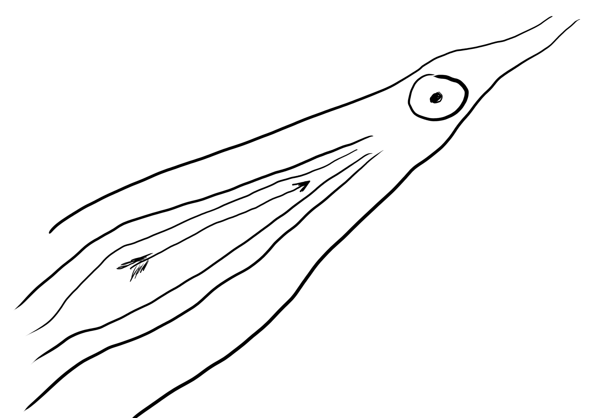

# Philosophie

Hier sind meine Philosophieeinträge.

## [Essay - Inspirationen und Gedankengänge zur Vorlesung Philosophie und Mathematik](Blog/Essay_-_Inspirationen_und_Gedankengänge_zur_Vorlesung_Philosophie_und_Mathematik.md)

Ein geschriebens Essay aus einer Vorlesung über Philosophie und Mathematik an der Uni Potsdam.

Mein Essay wird darüber handeln wie die Vorlesung sich auf mein
Verständnis von Philosophie und Mathematik auswirkte, sowie es einige
Ideen und Inspirationen in mir [auslöste](Blog/Essay_-_Inspirationen_und_Gedankengänge_zur_Vorlesung_Philosophie_und_Mathematik.md).

Vom 06.02.2026

## [Sinn und absurde Philosophie](Blog/Sinn_und_absurde_Philosophie.md)
[
  
](Blog/Sinn_und_absurde_Philosophie.md)

Jeder Mensch ist auf der Suche nach dem Sinn in seinem Leben. Die Philosophie kann ein Wegweiser sein, aber auch uns jeglichen Sinn im Leben nehmen, wie es der Philosoph Albert Camus in seinen Werken getan hat. Im Video wird deutlich warum und wie es philosophisch zu deuten ist. Er versuchte sogar einen Ausweg [zu ...](Blog/Sinn_und_absurde_Philosophie.md) vom 26.07.2021

## [Kyudotagebuch – Kari die Wildgans](Blog/Kyudotagebuch_-_Kari_die_Wildgans.md)
[
  
](Blog/Kyudotagebuch_-_Kari_die_Wildgans.md)

Foto von Clare Smallwood auf Unsplash In der letzten Woche fuhr ich wie gewohnt zum Berliner Kyudotraining und lass auf dem Weg dorthin die Kyudozeitschrift Zanshin. In einem Artikel von dem Großmeister Awa Kenzo, der sehr umstritten war in seinen Ansichten über Kyudo, aber einer der besten Schützen, der je gelebt hat. Man sagt [er ...](Blog/Kyudotagebuch_-_Kari_die_Wildgans.md) vom 22.07.2021

## [Kyudotagebuch – Im Flow sein](Blog/Kyudotagebuch_-_Im_Flow_sein.md)
[
  
](Blog/Kyudotagebuch_-_Im_Flow_sein.md)

In der vorletzten Woche ging es wieder weiter mit dem guten Kyudotraining. Als ich wie immer mit dem Zug zum Kyudo fuhr, hatte ich diesmal keine wirkliche Idee, worauf ich mich heute verstärkt konzentrieren sollte, also ein konkretes Ziel. Klar war für mich, an den Punkten zu arbeiten, die mir Thomas das letzte Mal [unterrichtet ...](Blog/Kyudotagebuch_-_Im_Flow_sein.md) vom 12.07.2021

## [Kyudotagebuch – Endlich aufs Mato schießen](Blog/Kyudotagebuch_-_Endlich_aufs_Mato_schießen.md)
[
  
](Blog/Kyudotagebuch_-_Endlich_aufs_Mato_schießen.md)

Von letzter Woche noch etwas voll mit neuen Eindrücken und gespannt wie es weiter geht, ging es wieder weiter mit dem Kyudotraining auf dem Platz. An diesem Montag war es sehr heiß, zum Glück war der Zug nicht voll und die Klimaanlagen taten ihr Bestes. Auf den wunderschönen Platz ankommend ging mit noch vom [letzten ...](Blog/Kyudotagebuch_-_Endlich_aufs_Mato_schießen.md) vom 25.06.2021

## [Kyudotagebuch – Ein Neubeginn](Blog/Kyudotagebuch_-_Ein_Neubeginn.md)
[
  
](Blog/Kyudotagebuch_-_Ein_Neubeginn.md)

Endlich, nach langer Abstinenz vom Kyudotraining durch die gute Corona geht es wieder los meine Freunde. Letzte Woche ging es wieder auf den Platz zum Kyudotraining. Die Bögen wurden aus ihrem Winterschlaf geweckt und fleißig gespannt, dazu wurden die Pfeile und die gesamte Ausrüstung einer gründlichen Überprüfung unterzogen, damit wir wieder befreit japanisches Bogenschießen [ausüben ...](Blog/Kyudotagebuch_-_Ein_Neubeginn.md) vom 22.06.2021