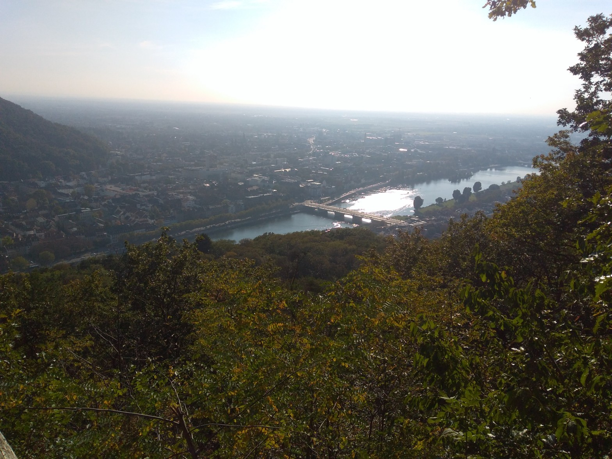

# Physik

Hier sind meine Physikeinträge.

## [Spring School 2024 AEI](Blog/Spring-school-2024.md)

Meine Zusammenstellung von Notizen von der Spring School 2024 am Albert Einstein Institut.

[Hier gehts zur Seite](https://christiang7.github.io/Spring-School-2024/#/) vom 4.4.2024

## [Kontinuirliche Gruppen und Symmetrien Unikurs](Blog/Gruppen-Symmetrie.md)

Meine Zusammenstellung von Notizen vom Kontinuirliche Gruppen und Symmetrien Kurs an der Universität Potsdam im Wintersemester 23/24.

[Hier geht es zur Seite](https://christiang7.github.io/Kontinuierliche_Gruppen_und_ihre_Anwendungen_in_der_Quantenphysik_Unikurs/#/) vom 4.4.2024

## [Numerical relativity hydrodynamics Unikurs](Blog/Numerical-relativity.md)

Meine Zusammenstellung von Notizen vom Numerical relativity hydrodynamics Kurs an der Universität Potsdam im Wintersemester 23/24.

[Hier geht es zur Seite](https://christiang7.github.io/Numerical_relativity_hydrodynamics_Unikurs/#/) vom 4.4.2024

## [Euclid Teleskop](Blog/Euclid_Teleskop.md)
[
  
](Blog/Euclid_Teleskop.md)
Foto von [ESA](https://www.esa.int/Science_Exploration/Space_Science/Euclid/Euclid_wallpapers)

Vor einigen Tagen am 1.7.2023 wurde ein weiteres Weltraumteleskop gestartet, das Euclid Teleskop. Es ist eines von vielen die derzeit im Weltraum den Weltraum beobachten wie [das Webb Teleskop ...](Blog/Euclid_Teleskop.md) vom 03.07.2023

## [Heidelbergreise - Tag 7 und Abreise](Blog/Heidelbergreise_Tag_7_und_Abreise.md)
[
  
](Blog/Heidelbergreise_Tag_7_und_Abreise.md)

Nach dem Tag in der Altstadt mit vollem Sightseeing, geht es heute ab in die Natur von Heidelberg. Am Morgen nur noch schnell im Hotel auschecken und dann gibt es noch eine kleine Reise hin zum Philosophenweg. Der Weg ging am Fuße des Heiligenbergs los. Der Berg ist ungefähr 430 m hoch und ich nahm [mir ...](Blog/Heidelbergreise_Tag_7_und_Abreise.md) vom 28\. October 2021

## [Heidelbergreise - Tag 6 und Stadterkundung](Blog/Heidelbergreise_Tag_6_und_Stadterkundung.md)
[
  
](Blog/Heidelbergreise_Tag_6_und_Stadterkundung.md)

Nach den Graduate Days ging es nun an die Stadterkundung und der näheren Umgebung. Am Morgen machte ich mir erst einmal Gedanken, was ich genau heute so alles sehen und erkunden wollen würde. Ich schnappte mir die ganzen Flyer vom Anreisetag und blätterte mal so durch. Aber zuerst kam mir noch in den Sinn [meine ...](Blog/Heidelbergreise_Tag_6_und_Stadterkundung.md) vom 23\. October 2021

## [Heidelbergreise - Tag 2-5 Graduate Days](Blog/Heidelbergreise_Graduate_Days_Tag_2-5.md)
[
  
](Blog/Heidelbergreise_Graduate_Days_Tag_2-5.md)

Die weiteren Tage mit den Graduate Days verliefen wie der Tag 1 ab und es gab einige Highlights, die ich hier näher beleuchten möchte. Dienstag Am Dienstag hatte ich mir noch kurz das Institut für theoretische Physik angeschaut, es liegt direkt am Philosophenweg. Die haben es dort sehr schön, alles wie in einem Garten [angelegt ...](Blog/Heidelbergreise_Graduate_Days_Tag_2-5.md) vom 14\. October 2021

## [Heidelbergreise - Tag 1 und der Anfang der Graduate Days](Blog/Heidelbergreise_Tag_1_und_der_Anfang_der_Graduate_Days.md)
[
  
](Blog/Heidelbergreise_Tag_1_und_der_Anfang_der_Graduate_Days.md)

Am Montag fingen die Graduate Days an der Heidelberger Universität an. Ich war am Sonntag schon da und wusste deshalb schnell, wohin ich zu gehen habe. Es regnete sehr stark am Morgen und ich fuhr das einzige Mal mit der Straßenbahn, ansonsten lief ich immer zur Uni. An der Uni einigermaßen trocken angekommen, wurde [Ich ...](Blog/Heidelbergreise_Tag_1_und_der_Anfang_der_Graduate_Days.md) vom 11\. October 2021

## [Heidelbergreise - Tag 0,5 und Anfahrt](Blog/Heidelbergreise_0,5_Tag_und_Anfahrt.md)
[
  
](Blog/Heidelbergreise_0,5_Tag_und_Anfahrt.md)

Großes Bild am Heidelberger Bahnhof Endlich ist es so weit, Heidelberg ich komme. Ich erfülle mir einen langersehnten Traum, einmal nach Heidelberg zu fahren und am 3.10. fuhr ich hin. Dafür musste ich sehr früh aufstehen, so um 5 Uhr, um nochmal alle Sachen zu checken und billig Zug zu fahren. Ich hatte zwar [kaum ...](Blog/Heidelbergreise_0,5_Tag_und_Anfahrt.md) vom 4\. October 2021

## [Mathematisches Pläuschchen – Farbige Formeln](Blog/Mathematisches_Pläuschchen_-_Farbige_Formeln.md)

In diesem Artikel werde ich die Formel erstmal mit weißem Hintergrund einfärben. In anderen Artikeln habe ich die Formeln bereits auf dunklem Hintergrund eingefärbt. Es folgt noch ein Nachtrag für dunkle Themes.

Einstein Gleichung aus der Relativitätstheorie

$$
 \colorbox{white}{$\color{black}{\color{blue}G}_{\color{darkred}ab} = {\color{teal}R}_{\color{darkred}ab} - \frac{{\color{blue} g}_{\color{darkred}ab}}{2}  {\color{teal}R} = -\frac{1}{2\gamma}{\color{blue}T}_{\color{darkred}ab}$}
$$

Schon seit meiner Schulzeit [begleiten ...](Blog/Mathematisches_Pläuschchen_-_Farbige_Formeln.md) vom 22\. July 2021